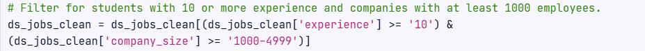

# Data Preprocessing for Efficient Storage of Customer Data

This project aims to transform the **customer_train.csv** dataset for **Training Data Ltd**. in order to optimize memory usage while preserving data integrity and usability. The transformation adheres to specific data storage requirements outlined by the Head Data Scientist.

# Objectives

### 1. Data Type Optimization:
- Convert columns with only two factors to **bool**.
- Store integer-only columns as 32-bit integers (**int32**).
- Store float columns as 16-bit floats (**float16**).
- Convert nominal categorical columns to the **category** data type.
- Convert ordinal categorical columns to **ordered categories**.

### 2. Data Filtering:
- Retain only students with **10 or more** years of experience.
- Include only companies with **1000 or more** employees.

# Dataset Description
- **relevant_experience**: Indicates if the student has relevant work experience.
- **enrolled_university**: Type of university enrollment (no enrollment, part-time, or full-time).
- **education_level**: Highest education level attained.
- **experience**: Years of professional experience.
- **company_size**: Size of the current company.
- **last_new_job**: Time since the last job change.

# Installation
Clone this repository and install the necessary libraries if required.

# Code Explanation
### 1. Reading the Data
Load the dataset using pandas.read_csv() and create a copy for transformation.

### 2. Defining Ordered Categories
Specify the natural order for categorical columns that require ordering.

### 3. Data Type Optimization
Loop through columns and adjust data types based on content and requirements.

### 4. Data Filtering
Apply conditions to retain relevant records.

### 5. Memory Usage Comparison
Compare memory usage before and after transformation using .info().

# Results
By implementing these transformations, we achieved a substantial decrease in memory usage, making the dataset more efficient for analysis and modeling.

#### Example Output

  ...

  ...

# Conclusion
This project showcases how thoughtful data preprocessing and type optimization can significantly enhance performance and efficiency in data science workflows.
